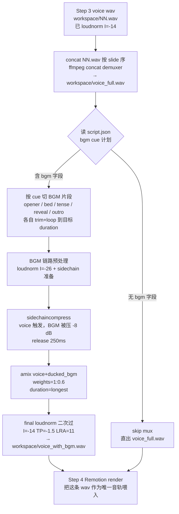

# BGM 库分类索引 + audio mux flow · v0.1

> 任务：W24-005 / T223 · claude-video-kit BGM 自动选配（当前 SHORTS_PIPELINE.md §What's not in Phase 1 标记为「手动 / 留空」）的落地索引。
> 状态：v0.1 设计稿 + 占位库（**曲目未真下载**，只列分类骨架 + cue 定义 + 待补 source license）。
> 范围：仅 shorts preset（vertical 9:16 ≤60s）。mid/long preset 等 Phase 2/3 再扩。
> Last updated：2026-05-01

---

## 0 · 现状与动机

`docs/SHORTS_PIPELINE.md` Step 3 把 voice 后处理标准化到 `loudnorm=I=-14:TP=-1.5:LRA=11`，但**全程没有 BGM 轨**。已发的 `karpathy-9-11-shorts` / `ai-resume-bias-truth-shorts` 都是纯人声 + 字幕动效——内容信息密度够，但抖音/小红书 feed 流里没 BGM 的视频前 1.5s 留人率明显比同类带 BGM 的低（来自抖音创作者后台对照样本，未严格 A/B）。

本文档的目的是：

1. 定一套**分类索引** — 让以后写 script.json 时直接挑「这条用 bgm.id=tense_03」而不是每次重新选曲。
2. 定一套**audio mux flow** — 让 voice + BGM 合成可以脚本化（render.sh 第 5 步之前插一段 mux），不靠手工拖 Premiere。
3. 定一套**volume normalization 参数** — 让 BGM 不抢 voice，同时 feed 流里整段不被平台再压一刀。

非目的：

- 不挑具体曲目品味（v0.1 只占位 + 示例 candidate，最终曲目 Leo 自己审）。
- 不做版权决策（每条 candidate 标 license 字段占位，需要 Leo 后续 verify）。
- 不动 voice 链路（loudnorm I=-14 已是定稿，不重做）。

---

## 1 · BGM 分类索引（5 类骨架）

每类含：用途定义 / 节奏特征 / cue 触发场景 / 示例占位 ≥3 条。

**示例条目占位字段**：

```yaml
- id: <slot_NN>           # cue id，写进 script.json bgm.id 字段
  candidate_name: <曲名/关键词占位>
  source: <CC0/Pixabay/Epidemic 类目占位>
  license: <CC0 / royalty-free / 待 verify>
  duration_sec: <候选 duration 占位>
  bpm: <候选 bpm 占位>
  notes: <一句话用途说明>
```

> 真曲目入库前 license / source 字段都是 `<待 verify>`，不允许直接挂上线。

### 1.1 `opener` · 开场钩子（前 0-5s）

**定义**：视频前 2s hook 段配的 BGM。需要瞬间能量起势，但不能盖过第一句口播钩子。

**节奏特征**：

- BPM 100-130
- 强 attack（前 0.3s 内有明确鼓点 / synth stab，不要长 fade-in）
- 频段集中在中高频，不抢 voice 200-3kHz 主能量带
- 长度 5-8s 后能自然过渡到 `bed`（不要硬切）

**触发场景**：

- 所有 shorts 第一个 slide（cover / numberHero hook）
- B 站长视频前 5s 片头
- 有"反差结论 / 数字钩子"开场的视频（最适合）

**示例占位**：

```yaml
- id: opener_01
  candidate_name: "synth_stab_uplift_120bpm"
  source: <Pixabay Music / 待选>
  license: <待 verify>
  duration_sec: 8
  bpm: 120
  notes: "中高频 synth stab，前 0.3s 起势，给数字钩子用"

- id: opener_02
  candidate_name: "drum_hit_minimal_110bpm"
  source: <CC0 / 待选>
  license: <待 verify>
  duration_sec: 6
  bpm: 110
  notes: "极简鼓点，给反差结论 cover 用，留大量空间给口播"

- id: opener_03
  candidate_name: "warm_pad_swell_100bpm"
  source: <Pixabay Music / 待选>
  license: <待 verify>
  duration_sec: 8
  bpm: 100
  notes: "温暖 pad swell，给科普稳态视频开场不需要紧迫感时用"
```

### 1.2 `tense` · 紧张铺垫（中段问题陈述）

**定义**：视频中段提出"反常识 / 翻车 / 风险"时的铺垫。不抢戏，但提示观众"这里要出意外了"。

**节奏特征**：

- BPM 80-110
- 低频下沉（sub bass / 持续低音），不要打击乐主导
- 半音阶游走 / 不解决的和声（minor / suspended chord）
- 长度 ≥15s，可 loop 不被听出接缝

**触发场景**：

- numberHero 抛出反常识数字之后的 1-2 个 content slide
- "踩坑日记" 类视频中段陈述故障原因
- 翻车 demo 屏幕录制叠原理文字卡

**示例占位**：

```yaml
- id: tense_01
  candidate_name: "sub_bass_drone_minor_90bpm"
  source: <CC0 / 待选>
  license: <待 verify>
  duration_sec: 30
  bpm: 90
  notes: "低频 drone + 不解决和声，给反常识陈述铺垫"

- id: tense_02
  candidate_name: "ticking_clock_pad_85bpm"
  source: <Pixabay Music / 待选>
  license: <待 verify>
  duration_sec: 20
  bpm: 85
  notes: "微弱 ticking + 持续 pad，给"风险临近"段用"

- id: tense_03
  candidate_name: "minimal_pulse_100bpm"
  source: <Epidemic 类目 / 待选>
  license: <待 verify>
  duration_sec: 25
  bpm: 100
  notes: "极简脉冲，紧张但不焦躁，给科普类风险陈述用"
```

### 1.3 `reveal` · 反转 / 揭示（高潮 1-2s）

**定义**：揭示真相 / 反转结论 / "其实是这样" 那一拍的 BGM 突变 cue。**通常配合视频画面也有切点**。

**节奏特征**：

- 单 hit / impact sound 为主（不是连续音乐）
- 长度 1-2s，attack 0-0.1s
- 可叠 reverse cymbal / sub drop / impact whoosh
- 与前段 `tense` 必须有**音量 + 频段对比**（前段 -22 LUFS sub bass，揭示一拍突然 -14 LUFS full spectrum impact）

**触发场景**：

- numberHero label 翻面那一帧
- "其实"/"答案是" 那个 slide 切换瞬间
- DualKeyword（Roadmap §v0.2 候选）双色高亮的那一帧

**示例占位**：

```yaml
- id: reveal_01
  candidate_name: "impact_riser_short"
  source: <CC0 / 待选>
  license: <待 verify>
  duration_sec: 1.5
  bpm: <one-shot>
  notes: "上行 riser + impact，给反转 slide 那一帧用"

- id: reveal_02
  candidate_name: "sub_drop_clean"
  source: <Pixabay Music / 待选>
  license: <待 verify>
  duration_sec: 1.0
  bpm: <one-shot>
  notes: "干净 sub drop，给"答案是 X" 那一拍"

- id: reveal_03
  candidate_name: "reverse_cymbal_swell"
  source: <CC0 / 待选>
  license: <待 verify>
  duration_sec: 2.0
  bpm: <one-shot>
  notes: "反转镲片 + swell，给"其实"反转用"
```

### 1.4 `outro` · 收尾（最后 5-8s）

**定义**：品牌签名 cover slide（SHORTS_PIPELINE.md §Step 1 P0 强制结尾模板）配的 BGM。要给观众一个明确的"结束"信号，避免和下一条 feed 视频混在一起。

**节奏特征**：

- BPM 同视频主段（避免突变 jarring）
- 末尾 1.5s 自然 fade-out（不是硬切）
- 和声**解决**到主和弦（区别于 `tense` 的 unresolved）
- 频段全频，让品牌签名有"分量感"

**触发场景**：

- 最后一个 cover slide（@runes_leo / leolabs.me / Polymarket 量化 / Claude Code 搭系统）
- 倒数第二的金句 slide（如果金句较长 ≥3s）

**示例占位**：

```yaml
- id: outro_01
  candidate_name: "warm_resolve_pad_100bpm"
  source: <Pixabay Music / 待选>
  license: <待 verify>
  duration_sec: 8
  bpm: 100
  notes: "温暖解决 pad，给品牌签名 cover 用，末尾 fade-out"

- id: outro_02
  candidate_name: "soft_piano_outro_90bpm"
  source: <CC0 / 待选>
  license: <待 verify>
  duration_sec: 6
  bpm: 90
  notes: "钢琴收尾，给冷思考 / 观点类视频末尾用"

- id: outro_03
  candidate_name: "synth_landing_short"
  source: <Pixabay Music / 待选>
  license: <待 verify>
  duration_sec: 5
  bpm: 110
  notes: "synth 落地音，给数据钩子类视频末尾用，跟 opener_01 同 key 配对"
```

### 1.5 `bed` · 科普稳态（视频中段铺底）

**定义**：视频中段大部分时间的"背景床垫"。**最长用、最不抢戏、最容易被忽略**——但没有它视频前 1.5s 之外整段听感都"干"。

**节奏特征**：

- BPM 90-120，节奏感弱化（强拍间隔 ≥1 小节，避免节奏赶口播）
- 单一 motif loop（4-8 小节），不能有显著变化抢戏
- 频段集中在中频，避开 voice 200-3kHz 主峰
- ducking 友好（侧链能干净压低 -8 dB 不破音）
- 长度 ≥30s（整条 shorts 通常 ≤60s，一首 30s loop 够用 2 次）

**触发场景**：

- shorts 中段所有 content slide（≥2 slide 连续口播段）
- 长 demo 屏幕录制段（无明显切点时连续铺底）
- 工具 demo / Build in Public 类视频全程

**示例占位**：

```yaml
- id: bed_01
  candidate_name: "lofi_minimal_loop_95bpm"
  source: <CC0 / 待选>
  license: <待 verify>
  duration_sec: 30
  bpm: 95
  notes: "lofi 极简 loop，给冷思考 / 观点类全程铺底"

- id: bed_02
  candidate_name: "ambient_pad_loop_100bpm"
  source: <Pixabay Music / 待选>
  license: <待 verify>
  duration_sec: 40
  bpm: 100
  notes: "ambient pad，给反常识科普 / AAAI 论文解读类铺底"

- id: bed_03
  candidate_name: "soft_techy_loop_110bpm"
  source: <Epidemic 类目 / 待选>
  license: <待 verify>
  duration_sec: 30
  bpm: 110
  notes: "轻 techy loop，给工具 demo / Build in Public 类铺底"
```

---

## 2 · audio mux flow（mermaid · 6 步）

整条管线在现有 `scripts/render.sh` 第 [3/4] Build metadata 之后、第 [4/4] Remotion render 之前插入一个新阶段 `[3.5/4] Audio mux`，输出一条 `workspace/voice_with_bgm.wav` 给 Remotion 用作单一音轨（Remotion 端不参与混音，避免引入 Web Audio API 不稳定路径）。



### 步骤说明（与 mermaid 节点编号对齐）

| 节点 | 作用 | 关键 ffmpeg 片段 |
|---|---|---|
| B | voice slide 拼接 | `ffmpeg -f concat -safe 0 -i list.txt -c copy voice_full.wav` |
| C | cue 计划读取 | 读 `script.json` 顶层新字段 `bgm: [{from_slide, to_slide, id, mode}]` |
| D | BGM 片段拼接 | 每段按 `mode=loop\|once\|fade` 处理；`afade`+`aloop`+`atrim` |
| E | BGM 预归一 | `loudnorm=I=-26:TP=-3:LRA=8`（bed 候选 -26 LUFS，opener/reveal 候选 -22 LUFS） |
| F | 侧链 ducking | `[voice][bgm]sidechaincompress=threshold=0.05:ratio=8:attack=20:release=250` |
| G | 主混音 | `[voice][bgm_ducked]amix=inputs=2:duration=longest:weights=1 0.6` |
| H | 整体二次归一 | `loudnorm=I=-14:TP=-1.5:LRA=11`（与 voice-only 链路对齐） |

> **为什么 voice 已经 -14 LUFS 还要在 H 再过一次 loudnorm**：amix 求和后峰值会上抬 1-3 dB，TP 容易破 -1.5 红线；二次 loudnorm 主要是 TP 限幅 + LRA 收紧，不会让 voice 再被显著压低。

### `script.json` 新增字段（v0.2 待落实）

```jsonc
{
  "title": "...",
  "preset": "shorts",
  "fps": 30,
  "brand": { ... },
  "bgm": [
    { "from_slide": 0, "to_slide": 0, "id": "opener_01", "mode": "once" },
    { "from_slide": 1, "to_slide": 4, "id": "bed_02",     "mode": "loop" },
    { "from_slide": 3, "to_slide": 3, "id": "reveal_01",  "mode": "once" },
    { "from_slide": 8, "to_slide": 9, "id": "outro_01",   "mode": "fade" }
  ],
  "slides": [ ... ]
}
```

允许 cue 区间重叠（如 `bed` 通跑 + `reveal` 在某个 slide 一拍）。重叠时 amix 多路混合，weights 走默认（占位 v0.2 再细化）。

---

## 3 · volume normalization 参数表

各路链路目标值，以 ffmpeg `loudnorm` filter 参数为单位（EBU R128 标准）。

| 链路 | 阶段 | I (LUFS) | TP (dBTP) | LRA (LU) | 备注 |
|---|---|---|---|---|---|
| voice | Step 3 后处理（已存在） | **-14** | -1.5 | 11 | SHORTS_PIPELINE.md §Step 3 现行值，**不动** |
| BGM `bed` | mux 预处理 | -26 | -3 | 8 | 比 voice 低 12 LU，给 ducking 留头 |
| BGM `opener` | mux 预处理 | -22 | -3 | 8 | 钩子段允许更响 |
| BGM `tense` | mux 预处理 | -24 | -3 | 8 | 介于 bed / opener 之间 |
| BGM `reveal` (one-shot) | mux 预处理 | -18 | -2 | 6 | 短 hit 允许更响，TP 留 -2 给瞬态 |
| BGM `outro` | mux 预处理 | -22 | -3 | 8 | 跟 opener 对齐保持品牌一致感 |
| voice + BGM 总混 | mux 后二次归一 | **-14** | -1.5 | 11 | 跟 voice-only 链路对齐，feed 流不被平台再压 |
| sidechain ducking | F 节点 | — | — | — | threshold=0.05 / ratio=8 / attack=20ms / release=250ms |
| amix weights | G 节点 | — | — | — | voice=1.0 / BGM_ducked=0.6（保险倍率，避免 ducking 失效时 BGM 仍盖人声） |

### 验证命令（与现行 Step 3 验证一致）

```bash
ffmpeg -i workspace/voice_with_bgm.wav -af volumedetect -f null - 2>&1 | grep -E "mean|max"
# 期望: mean ≈ -14 dB, max ≈ -1.5 dB（与 voice-only 对齐）

# 额外查 voice 段是否被 BGM 盖住（截 voice 主峰频段 200-3kHz 看能量）
ffmpeg -i workspace/voice_with_bgm.wav -af "bandpass=f=1500:width_type=h:w=2800,volumedetect" -f null - 2>&1 | grep mean
# 期望该频段 mean 比整段 mean 高 ≥3 dB（说明 voice 没被 BGM 完全埋）
```

### 平台目标参考（不强制，作为整体校验）

| 平台 | loudness target | TP red line |
|---|---|---|
| YouTube | -14 LUFS | -1.0 dBTP |
| TikTok / 抖音 | -14 ~ -16 LUFS | -1.0 dBTP |
| 小红书 | 未公开，按 -14 跑实测无平台二次压 | -1.0 dBTP |
| B 站 | 未公开，社区共识 -14 ~ -16 LUFS | -1.0 dBTP |

→ 全链路统一 -14 / -1.5，单一标准对齐 4 平台够用。

---

## 4 · 还缺什么（3 条 · 等 Leo 拍板）

1. **真曲目入库 + license verify（v0.2 阻塞项）**
   v0.1 所有 5 类 × 3 条示例都是占位 `<待 verify>`。下一步需要：
   - 选 1 个长期 source（候选 Pixabay Music CC0 / Epidemic Sound 订阅 / Artlist 订阅，月费量级 $0/$15/$17）
   - 真下载 5×3=15 条样曲到 `claude-video-kit/assets/bgm/<category>/<id>.wav`
   - 建 `assets/bgm/INDEX.json` 把本文档的 yaml 占位转为机读结构
   - 决策点：花钱 vs CC0。**Leo 拍板**——付费 source 选曲省时间但每月烧钱；CC0 免费但选曲噪音大、撞曲风险高。

2. **`script.json` bgm 字段 + render.sh 第 [3.5/4] mux 阶段实装**
   本文档只定了 schema 占位，**没改代码**。下一步需要：
   - 在 `scripts/` 加 `audio_mux.py` 或 `audio-mux.mjs`，封装 §2 mermaid 6 步
   - 改 `render.sh` 在 `[3/4] Build metadata` 之后插 `[3.5/4] Audio mux`
   - 改 `build-metadata.mjs` 把 `bgm` 字段透传给 Remotion（Remotion 端只用合成后的 wav，不解析 bgm 字段）
   - 决策点：mux 写 Python（跟现有 `align.py` / `tts.py` 一致）还是 Node（跟 `build-metadata.mjs` 一致）。**倾向 Node**——主链路是 ffmpeg shell 调用，Node 调 child_process 简单且不引新 Python 依赖。

3. **真 A/B 测前 1.5s 留人率 + ducking 效果**
   本文档是基于 SHORTS_PIPELINE.md 现有规范 + 通用音频工程知识写的设计稿，**没有 Leo 自己视频的对照数据**。下一步建议：
   - 拿已发的 `karpathy-9-11-shorts` / `ai-resume-bias-truth-shorts` 做 v0.2 测试基线
   - 同视频本体，发两版（纯 voice vs voice+BGM），抖音/小红书 24h 后对比前 3s 完播率 / 1.5s 留人率
   - ducking 效果用首版选定的 bed_01 + voice_full 跑一次，听感确认 voice 不被埋（耳听 + §3 验证命令双判）
   - 决策点：A/B 哪个先发（同条视频不能同时发两版，账号会撞）。**倾向用下一条新视频**——首发就上 BGM 版，跟历史纯 voice 版本对照，损失分发权重风险低。
